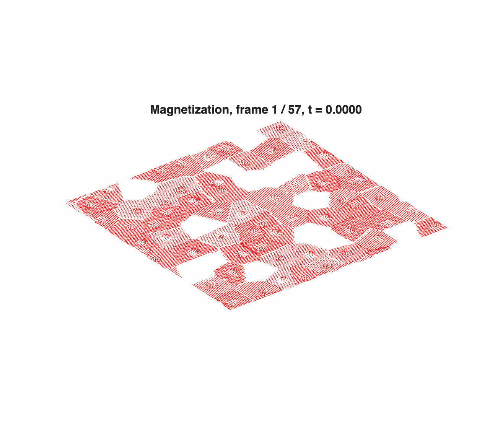
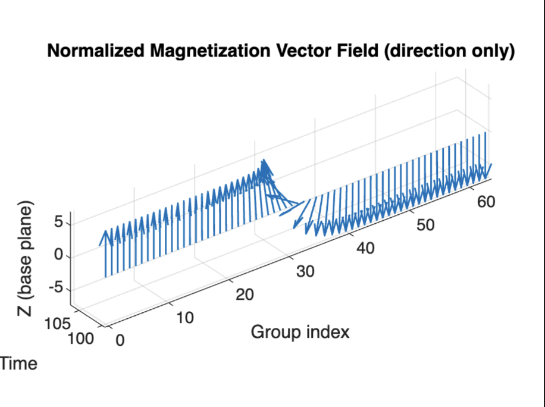
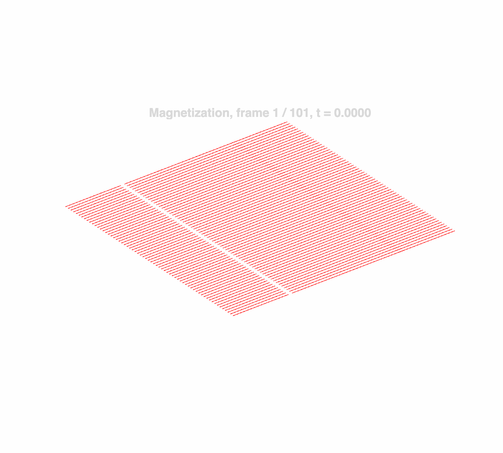

<!DOCTYPE html>
<html>
<head>
  <meta charset="UTF-8">
  <title>GPU Micromagnetic Simulation</title>

  
</head>

<body>

  <h1>GPU Micromagnetic Simulation with Irregular Geometry</h1>

  

    This project studies GPU-accelerated micromagnetic simulation using CUDA,
    cuFFT, and SUNDIALS/CVODE. The goal is to simulate 1D, 2D, FFT-based,
    and irregular-geometry Landau-Lifshitz-Gilbert dynamics, with emphasis on
    how geometry, demagnetization fields, and GPU implementation choices affect
    both physical behavior and performance.
  

  <h2>Links</h2>
  <ul class="links">
    <li>
      <a href="https://github.com/Angelawoo572/gpu-micromagnetics-irregular" target="_blank">
        GitHub Repository
      </a>
    </li>
    <li>
      <a href="report/proposal_ode_solver.pdf" target="_blank">
        Project Proposal PDF
      </a>
    </li>
    <li>
      <a href="report/report_ode_solver.pdf" target="_blank">
        Milestone Report PDF
      </a>
    </li>
    <li>
      Final Report PDF: coming soon
    </li>
  </ul>

  <h2>What Physical Problem Is Simulated?</h2>

  

    The project simulates micromagnetic domain evolution in thin magnetic films.
    The examples are motivated by classical magnetic-domain structures such as
    Bloch walls, Néel-like spike domains near defects, cross-tie structures, and
    asymmetric domain walls. In the code, these physical ideas are represented
    by the Landau-Lifshitz-Gilbert equation with exchange, anisotropy, DMI-like
    local interactions, demagnetization fields, and irregular masks such as
    holes, rings, or dead grains.
  

  

    The most advanced version is the irregular FFT-demag simulation: a
    Voronoi-polycrystal magnetic film with dead-grain holes, where local stencil
    physics is combined with a long-range demagnetization field computed by
    cuFFT. This is the closest version to the classical “defect interacting
    with domain walls / spike domains” examples shown in micromagnetics
    literature.
  

  <h2>Highlighted Results</h2>

  

    

      <h3>Irregular FFT Demag: Voronoi Polycrystal + Dead-Grain Holes</h3>
      
      

        This is the main showcase simulation. It combines irregular grain
        geometry, dead-grain holes, local magnetic interactions, and FFT-based
        demagnetization. It is the strongest example for showing domain-wall
        bending, defect effects, and non-uniform magnetization dynamics.
      

    

    

      <h3>i3 Top View: Magnetization Component Map</h3>
      
      

        Top-view visualization of the same irregular FFT-demag system. This
        view makes the domain evolution easier to compare with classical
        microscopy images of spike domains and domain-wall motion near defects.
      

    

    

      <h3>1D Correctness Test</h3>
      
      

        A simpler 1D test case used to check correctness before moving to 2D
        and irregular geometries.
      

    

    

      <h3>2D Periodic Simulation</h3>
      
      

        Baseline 2D periodic simulation. This version shows the transition from
        simple regular-grid dynamics toward more complex 2D magnetic textures.
      

    

    

      <h3>2D FFT Demagnetization</h3>
      
      

        Extension of the 2D solver with FFT-based long-range demagnetization.
        This adds the nonlocal field needed for realistic thin-film domain
        behavior.
      

    

    

      <h3>Irregular Antidot / Hole Geometry</h3>
      
      

        Irregular geometry example with FFT demagnetization. This tests how
        holes and masks perturb the magnetization field.
      

    

  

  <h2>Additional Irregular Geometry Examples</h2>

  

    

      <h3>i4 Geometry, 1:4 Ratio</h3>
      
      

        Geometry-ratio sweep showing how changing the shape of the irregular
        region changes the domain pattern.
      

    

    

      <h3>i4 Geometry, 1:8 Ratio</h3>
      
      

        A more elongated geometry case, useful for comparing how aspect ratio
        affects domain-wall motion and field concentration.
      

    

    

      <h3>i5 Ring / Ring-Hole Geometry</h3>
      
      

        Ring-based irregular geometry. This tests whether the same solver can
        support different active and inactive mask layouts with only small code
        changes.
      

    

    

      <h3>i6 Circular Geometry</h3>
      
      

        Circular-mask example showing another irregular geometry case. This is
        useful for demonstrating that the implementation is not restricted to a
        single hand-coded shape.
      

    

  

  <h2>Code Organization</h2>

  

    The source code is organized under <code>src/</code>. Input and configuration
    files are placed under <code>configs/</code>. Generated figures, animations,
    and profiling outputs are stored under <code>results/</code>. The
    <code>report/</code> folder contains the proposal, milestone report, and
    final report when available.
  

  <h2>Proposal Preview</h2>
  <embed src="report/proposal_ode_solver.pdf" type="application/pdf">

  <h2>Milestone Report Preview</h2>
  <embed src="report/report_ode_solver.pdf" type="application/pdf">

</body>
</html>